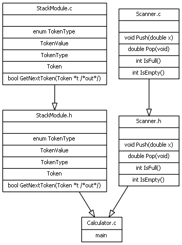

# **Asignatura:** Sintaxis y Semantica de los Lenguajes de Programacion
## **Curso:** K2051
## **Año de cursada:** 2017
## **Numero de equipo:** 5

## **Integrantes**

### Tomas Benz	|	tomasbenz	

### Emiliano Guiggiaro	| eguiggiaro

## **TP:** 5 - Calculadora Polaca

***
* Diagrama de dependencias

	

### Preguntas y respuestas

* a. ¿Es necesario modificar StackModule.h? ¿Por qué?

En nuestro caso no lo modificamos ya que nuestro stack se codificó para soportar doubles.

* b. ¿Es necesario recompilar la implementación de Stack? ¿Por qué?

No fue necesario recompilarla.

* c. ¿Es necesario que Calculator muestre el lexema que originó el error léxico? Justifique su decisión.

Sí, es necesario para mejorar la búsqueda de errores. Se muestra el carácter de error leído, que no corresponde con ninguno de los tokens definidos.

